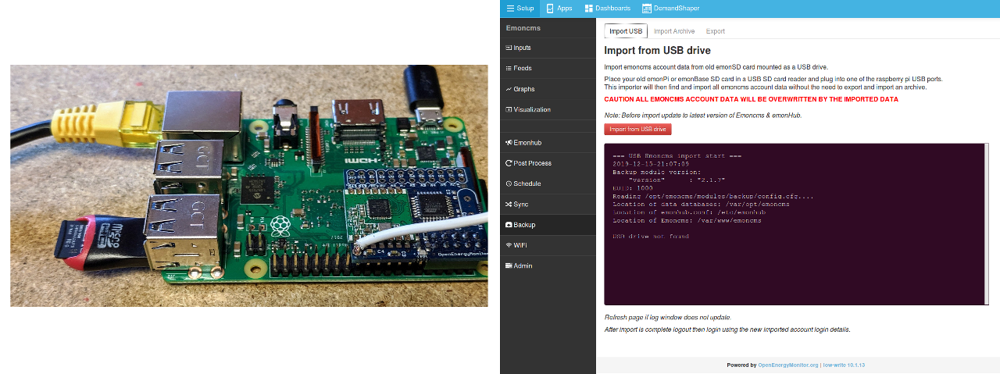

# Import / Backup / Restore / Update

## Emoncms Backup Module

The [Emoncms backup module](https://github.com/emoncms/backup) can be used to backup and restore/import an emoncms installation and migrate from an older emonPi / emonBase image to the latest image.

There are two methods available to do this:

1. Import/Restore an emoncms installation directly without a previous backup archive using a USB SD card reader.
2. Export and import a compressed archive containing all emoncms user data.

The direct USB SD card reader approach is the most straightforward method for migration from an old SD card to a new SD card running the latest emonSD image. It can also minimise data loss in the event of a system failure where a recent archive backup has not been created.

The archive export/import approach is useful for creating backup snapshot's and can be a good fall back in the case of more serious SD card corruption. An archive export will however be needed prior to the failure point.

Currently the Backup Module can only be used with Local Emoncms <strong>not</strong> Emoncms.org 

## Update SD Card and Import using an USB SD card reader

This process will take you through creating a new SD Card, the initial boot and then importing your current system (data, settings, dashboards etc).

### 1. Prepare a new card

It is a good idea to start with a new SD Card to minimise risk of disk errors from previous use, though reuse should also be fine if lightly used. A 16Gb card should suffice; emonCMS is very efficient in the way it stores it's data.

There are 2 options for a new card:

1. Purchase a new card with the image pre-installed, from the [OEM Store](https://shop.openenergymonitor.com/emonsd-pre-loaded-raspberry-pi-sd-card/).
2. Burn/flash a new image to an SD Card. To do this:
    1. Download image from the [Release Page](https://github.com/openenergymonitor/emonpi/wiki/emonSD-pre-built-SD-card-Download-&-Change-Log).
    2. The easiest method of flashing the new image to an SD card is to use a cross-platform tool called Etcher, see: [https://www.etcher.io/](https://www.etcher.io/)

### 2. Install Card and Initial boot

1. Shutdown your existing system by clicking on Shutdown on the emonCMS Admin page, after 30s remove the USB power cable to fully power down.
2. Remove your existing SD card (you will need this SD card again in a moment).

    1. On an EmonPi replacing the card will involve removing the Black end plate with a Torx Bit (T20).
    2. You can then access the SD Card (circled below). Use a pair of pliers or tweezers. Older Pis are push to release.

3. Insert the new SD card (and replace the end plate on the emonPi) & power up the device. Then wait, wait, wait, make a cup of coffee, wait, wait, wait… (lots of updates etc) - really do not rush this part it does take a while.
4. If you do not have a wired Ethernet connection you will need to [setup your WiFi](https://guide.openenergymonitor.org/setup/connect/#1a-connect-to-wifi). **Note** the updates will not happen until after you have connected the Pi to the Internet.

Once the initial update and setup is complete, you can proceed to import your data, settings etc.

### 3. Restoring your system

1. Place the old SD card in an SD card reader and plug into any of the USB ports on the emonPi/emonBase running the new image.
2. From the emonCMS login page, click register and create a temporary user. Once the import is complete the original user details will be used.
3. Navigate to Setup > Backup
4. Click `Import from USB drive` to start import process
5. Once the import is complete, log out and back into the emonCMS page with the original user details

## Fixing a corrupt SD card

After a system failure the SD card may become corrupted and will not mount when the USB importer is ran. It can be possible to restore a corrupted SD card by running fsck to fix the card errors. To do this: 

1\. Place the old SD card in a SD card reader and plug into any of the USB ports on the Pi running the new image 
2\. SSH into the emonPi/emonbase 
3\. Run the following commands (without part in brackets) to attempt to fix the card: 

<pre style="font-family:monospace; font-size:14px; background-color: #eee; padding: 20px;">
sudo fsck.ext4 /dev/sda2 (root OS partition)
sudo fsck.ext2 /dev/sda3 (data partition)
</pre>

4\. Continue as above, Navigate to Setup > Backup and click `Import from USB drive` to start import process

---

## Backup Module Archives

### Archive Export

1. Navigate to Setup > Backup
2. Click `Create Backup` (see screenshot below)
3. Wait for backup to be created, then refresh the page to view `Download Backup` link
4. Download `.tar.gz` compressed backup

### Archive Import

Importing / restoring a backup will overwrite <strong>ALL</strong> data in the current Emoncms account.

*Note for emonSD-30Oct18.img.zip: If the image has been written to an SD card larger than 4GB the data partition should be expanded to fill the SD card to create sufficient space to import a backup. **Do not use Raspbian raspi-config**, instead connect via SSH and run `$ sudo emonSDexpand` and follow prompts.*

*The latest emonSD-17Oct19.img.zip has already been expanded to fit a minimum 16 GB SD card size. To expand the data partition further run: `/opt/emoncms/modules/usefulscripts/sdpart/./sdpart_imagefile`.*

To import a backup:

1. Check available disk space in the data partition (`/var/opt/emoncms`), see `Local Emoncms > Setup > Admin`
1. Select `.tar.gz` backup file
2. Wait for upload to complete
3. Click `Import Backup`
4. Check restore log (see below)
5. Log out then log back into Local Emocms using the imported account login credentials

Backup <b>tar.gz</b> filename cannot contain any spaces; e.g., if the same backup has been downloaded more than once: rename <b>'emoncms-backup-2016-04-23 (1).tar'</b> to <b>'emoncms-backup-2016-04-23.tar'</b> before uploading.

*`emonSDexpand` will run `~/usefulscripts/sdpart/./sdpart_imagefile` script, for more info see [Useful Scripts Readme](https://github.com/emoncms/usefulscripts#sdpart_imagefile)*

### Successful import log example

<button type="button" class="show_hide" href="#" rel="#slidingDiv">View</button>

<pre>
=== Emoncms import start ===
2019-10-18-08:21:15
Backup module version:
cat: /opt/emoncms/modules/backup/backup/module.json: No such file or directory
EUID: 1000
Reading /opt/emoncms/modules/backup/config.cfg....
Location of data databases: /var/opt/emoncms
Location of emonhub.conf: /etc/emonhub
Location of Emoncms: /var/www/emoncms
Backup destination: /opt/openenergymonitor/data
Backup source path: /opt/openenergymonitor/data/uploads
Starting import from /opt/openenergymonitor/data/uploads to /opt/openenergymonitor/data...
Image version: emonSD-17Oct19
new image
Backup found: emoncms-backup-2019-10-18.tar.gz starting import..
Read MYSQL authentication details from settings.php
Decompressing backup..
emoncms.sql
emonhub.conf
settings.ini
phpfina/
phpfina/165119.meta
phpfina/165146.dat
phpfiwa/
phptimeseries/
Removing compressed backup to save disk space..
Stopping services..
Emoncms MYSQL database import...
Import feed meta data..
Restore phpfina and phptimeseries data folders...
Import emonhub.conf > /etc/emonhub/emohub.conf
OK
Restarting emonhub...
Restarting feedwriter...
2019-10-18-08:26:56
=== Emoncms import complete! ===
</pre>

---

### Included in backup

- Emoncms account credentials
- Historic Feed data
- Input Processing config
- Emoncms Dashboards
- Emoncms App settings
- EmonHub config: `emonhub.conf`

### Not included in backup

- WiFi passcode & custom network config
- Custom NodeRED flows (old systems with this included)
- Custom openHAB settings (old systems whith this included)
- Input processing setup if migrating from Emoncms V8, input processing will need to be re-created after import and new inputs should be logged to imported feeds
- Any other system or software modifications

### How-to backup items not automatically included

- nodeRED custom flows: select all flows then `menu > export > clipboard` copy the JSON text (deprecated)
- Connect via SSH:
  - See credentials for your image [emonSD download](../emonsd/download.md)
  - WiFi settings & password: backup copy: `~/data/wpa_supplicant.conf`
  - openHAB custom config: copy `~/data/open_openHab` folder (deprecated)

---

### Video Guide (Export/Import method)

The following video guide was put together using emoncms v9, the appearance will be different if you are using v10 of emoncms or newer but the functionality is much the same. We will be updating this video soon.

<iframe width="560" height="315" src="https://www.youtube.com/embed/5U_tOlsWjXM" frameborder="0" allowfullscreen></iframe>

 

## Troubleshooting

If you have any questions or if an error occurs during the backup or import process please post in the [`Hardware > emonPi` category of the Community Forums](http://community.openenergymonitor.org/c/hardware/emonpi). Please provide as much information as possible e.g. backup / import logs and [emonSD version](https://github.com/openenergymonitor/emonpi/wiki/emonSD-pre-built-SD-card-Download-&-Change-Log).

Alternatively try and perform a manual import, see [Backup Module Readme](https://github.com/emoncms/backup).

## Export from an older emonPi / emonBase

If the Backup module is not visible in the Local Emoncms menu then the emonPi / emonBase is running an older version e.g Emoncms V8.x. Try the USB Import method above.

To check what software stack (emonSD pre-built SD card) version an emonPi is running see instructions on emonPi <a href="https://github.com/openenergymonitor/emonpi/wiki/emonSD-pre-built-SD-card-Download-&-Change-Log">emonSD download repository and changelog</a>

